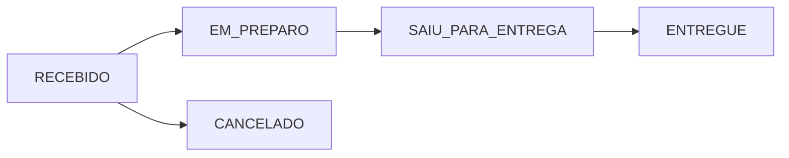

<div align="center">

# 🚚 Mini Rastreador de Pedidos

### Sistema fullstack para gerenciamento de pedidos de delivery

*Cadastro de usuários, autenticação JWT, criação e acompanhamento de pedidos com atualização de status em tempo real.*

</div>

---

## 🌐 Aplicação em produção

O projeto está **totalmente implantado e funcional**, com backend e frontend publicados e integrados entre si:

| Camada | Status | Link |
|---|---|---|
| 🖥️ **Frontend** (Vercel) | 🟢 Online | [mini-rastreador-hpz1-oz6e03l23-geandrols-projects.vercel.app](https://mini-rastreador-hpz1-oz6e03l23-geandrols-projects.vercel.app/) |
| ⚙️ **Backend / API** (Render) | 🟢 Online | [mini-rastreador.onrender.com](https://dashboard.render.com/) |
| 📑 **Documentação Swagger** | 🟢 Online | [/swagger-ui/index.html](https://mini-rastreador.onrender.com/swagger-ui/index.html) |

> ⚠️ **Observação:** o backend está hospedado no plano gratuito do Render. Após períodos de inatividade, o serviço "dorme" e a primeira requisição pode levar até ~1 minuto para responder enquanto o servidor é reativado. Esse comportamento é esperado e não indica erro na aplicação.

<br>

## 📌 Índice

- [Visão geral](#-visão-geral)
- [Arquitetura](#️-arquitetura-geral)
- [Backend](#️-backend)
- [Frontend](#-frontend)
- [Fluxo de status do pedido](#-fluxo-de-status-do-pedido)
- [Segurança](#-segurança)
- [Como rodar localmente](#️-como-rodar-localmente)
- [Próximas melhorias](#-próximas-melhorias)
- [Autor](#-autor)

<br>

## 📖 Visão geral

O **Mini Rastreador de Pedidos** é uma aplicação fullstack composta por duas partes independentes que se comunicam via API REST:

- **`/backend`** — API construída em **Java + Spring Boot**, responsável por regras de negócio, persistência de dados e autenticação via JWT.
- **`/frontend`** — Interface construída em **React + Vite + TypeScript**, responsável pela experiência do usuário, consumo da API e gerenciamento de sessão.

Ambos os módulos possuem README próprio com detalhes técnicos completos:

- 📄 [`backend/README.md`](./backend/README.md)
- 📄 [`frontend/README.md`](./frontend/README.md)

<br>

## 🏗️ Arquitetura geral

```text
┌─────────────────────────┐        HTTPS / JSON        ┌──────────────────────────┐
│        Frontend         │  ─────────────────────────▶ │         Backend          │
│   React + Vite + TS     │                              │   Java + Spring Boot     │
│   (Vercel)               │ ◀───────────────────────────│   (Render)                │
└─────────────────────────┘        JWT Bearer Token      └──────────────┬───────────┘
                                                                          │
                                                                          ▼
                                                                 ┌────────────────┐
                                                                 │     MySQL      │
                                                                 └────────────────┘
```

<br>

## ⚙️ Backend

API REST desenvolvida com **Spring Boot**, seguindo arquitetura em camadas (Controller → Service → Repository → Model/DTO).

**Principais funcionalidades:**
- Cadastro e autenticação de usuários (senhas criptografadas com BCrypt)
- Criação, listagem e busca de pedidos
- Atualização de status do pedido
- Autenticação stateless via JWT

**Tecnologias:** Java 17, Spring Boot 3, Spring Security, Spring Data JPA, Hibernate, MySQL, Maven.

**Deploy:** [Render](https://mini-rastreador.onrender.com) · **Docs:** [Swagger UI](https://mini-rastreador.onrender.com/swagger-ui/index.html)

📄 Detalhes completos (modelo de dados, endpoints, segurança) em [`backend/README.md`](./backend/README.md).

<br>

## 🎨 Frontend

Interface web construída em **React + Vite + TypeScript**, responsável pela autenticação, gerenciamento de sessão e consumo da API do backend.

**Principais funcionalidades:**
- Login e cadastro de usuários
- Armazenamento do JWT e rotas protegidas
- Listagem e criação de pedidos com múltiplos itens
- Interface estilizada com Tailwind CSS

**Tecnologias:** React 18, Vite, TypeScript, React Router DOM, Axios, Tailwind CSS.

**Deploy:** [Vercel](https://mini-rastreador-hpz1-oz6e03l23-geandrols-projects.vercel.app/)

📄 Detalhes completos (estrutura de pastas, variáveis de ambiente, endpoints consumidos) em [`frontend/README.md`](./frontend/README.md).

<br>

## 🚦 Fluxo de status do pedido



<br>

## 🔐 Segurança

- Autenticação stateless via **JWT** (`Authorization: Bearer <token>`)
- Senhas armazenadas com hash **BCrypt**, nunca em texto puro
- Campo de senha ignorado em qualquer resposta serializada da API
- Rotas públicas restritas a cadastro, login e documentação Swagger

<br>

## ▶️ Como rodar localmente

### Backend

```bash
git clone https://github.com/geandrol/Mini-rastreador.git
cd Mini-rastreador/backend
mvn spring-boot:run
```

A API sobe em `http://localhost:8080`.

### Frontend

```bash
cd Mini-rastreador/frontend
npm install
npm run dev
```

A aplicação sobe em `http://localhost:5173`.

> Configure o arquivo `.env` do frontend apontando para o backend local ou para o backend em produção:
> ```env
> VITE_API_URL=http://localhost:8080
> ```

<br>

## 📚 Próximas melhorias

- [x] Deploy do backend (Render)
- [x] Deploy do frontend (Vercel)
- [x] Autenticação JWT
- [x] Documentação via Swagger
- [ ] Controle de acesso por roles/permissões
- [ ] Dashboard com métricas
- [ ] Paginação de pedidos
- [ ] Testes automatizados (backend e frontend)
- [ ] Dockerização completa da aplicação

<br>

## 👨‍💻 Autor

<div align="center">

**Geandro Araujo**

Projeto fullstack desenvolvido para estudo, portfólio e demonstração de conhecimentos em **Java, Spring Boot, React, TypeScript e integração de APIs REST**, com backend e frontend publicados em produção.

⭐ Se este projeto foi útil, deixe uma estrela no repositório!

</div>
