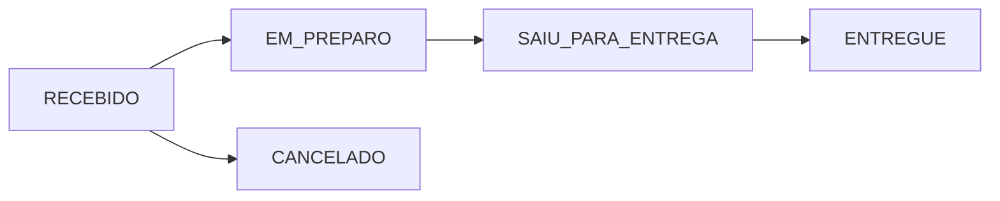

<div align="center">

# 🚚 Mini Rastreador de Pedidos

### Sistema Full Stack para gerenciamento de pedidos de delivery

Aplicação desenvolvida como desafio técnico utilizando **Java + Spring Boot** no backend e **React + TypeScript** no frontend, com autenticação JWT, documentação Swagger e deploy em cloud.


</div>

---

# 📌 Sobre o projeto

O Mini Rastreador de Pedidos é uma aplicação completa para gerenciamento de pedidos de delivery.

O sistema permite:

- Cadastro e autenticação de usuários
- Controle de clientes
- Cadastro de pedidos
- Atualização do status da entrega
- Rastreamento do pedido
- Comunicação entre Frontend e Backend através de API REST

Toda a aplicação foi construída utilizando arquitetura em camadas seguindo boas práticas de desenvolvimento.

---

# ✨ Funcionalidades

## 👤 Usuários

- Cadastro de usuários
- Login
- Senhas criptografadas com BCrypt
- Autenticação utilizando JWT
- Proteção de rotas

---

## 📦 Pedidos

- Criar pedidos
- Buscar pedidos
- Listar pedidos
- Atualizar status
- Histórico de pedidos

---

## 🚚 Fluxo do Pedido



---

# 🏗 Arquitetura

```
Frontend (React)

↓

API REST

↓

Controller

↓

Service

↓

Repository

↓

MySQL
```

Backend organizado em camadas:

```
controller
service
repository
model
dto
security
config
exception
```

---

# 🛠 Tecnologias

## Backend

- Java 17
- Spring Boot 3
- Spring Security
- Spring Data JPA
- Hibernate
- JWT
- BCrypt
- Maven

---

## Frontend

- React
- TypeScript
- Vite
- Axios
- React Router

---

## Banco

- MySQL

---

## Documentação

- Swagger / OpenAPI

---

## Ferramentas

- Git
- GitHub
- Postman
- VS Code
- IntelliJ / STS

---

# 🔐 Segurança

A aplicação utiliza:

- JWT Authentication
- BCryptPasswordEncoder
- Spring Security
- Rotas protegidas
- Autorização baseada em Token

Fluxo:

```
Login

↓

JWT

↓

Bearer Token

↓

Requisições autenticadas
```

---

# 📑 Documentação da API

Após iniciar o backend:

```
http://localhost:8080/swagger-ui/index.html
```

OpenAPI:

```
http://localhost:8080/v3/api-docs
```

---

# 📦 Modelo de Dados

## Usuário

- id
- nome
- email
- senha

---

## Pedido

- id
- dataPedido
- status
- cliente
- endereço
- itens

---

## Item

- id
- produto
- quantidade
- preço

---

## Endereço

- rua
- número
- bairro
- cidade
- complemento

---

# 🚀 Como executar

## Backend

```bash
git clone https://github.com/geandrol/Mini-rastreador.git

cd backend

mvn spring-boot:run
```

---

## Banco

Criar:

```sql
CREATE DATABASE pedidos_db;
```

Configurar:

```properties
spring.datasource.url=jdbc:mysql://localhost:3306/pedidos_db

spring.datasource.username=root

spring.datasource.password=senha

spring.jpa.hibernate.ddl-auto=update
```

---

## Frontend

```bash
cd frontend

npm install

npm run dev
```

---

# 🌐 Deploy

## Backend

Deploy realizado em Cloud utilizando Spring Boot.

## Frontend

Deploy realizado na Vercel.

---

# 🔌 Principais Endpoints

## Autenticação

```
POST /usuarios/cadastro

POST /usuarios/login
```

---

## Pedidos

```
GET /pedidos

GET /pedidos/{id}

POST /pedidos

PUT /pedidos/{id}/status
```

---

## Clientes

```
GET /clientes

POST /clientes
```

---

# 📋 Diferenciais do Projeto

✅ Arquitetura em camadas

✅ DTOs

✅ Spring Security

✅ JWT Authentication

✅ BCrypt

✅ Swagger/OpenAPI

✅ API REST

✅ React + TypeScript

✅ Integração Frontend/Backend

✅ Tratamento de exceções

✅ Deploy em Cloud

---

# 🔮 Próximas melhorias

- Testes unitários
- Testes de integração
- Docker
- Docker Compose
- CI/CD
- Refresh Token
- Recuperação de senha
- Upload de imagens
- Painel administrativo
- Monitoramento com Actuator

---

# 👨‍💻 Autor

**Geandro**

Desenvolvedor Full Stack

Java • Spring Boot • React • TypeScript • MySQL

GitHub:

https://github.com/geandrol

LinkedIn:

(adicione seu LinkedIn aqui)
